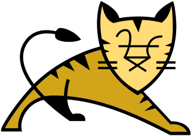

# Assignment 1: Train to Javari Park

CSGE601021 Programming Foundations 2 @ Faculty of Computer Science Universitas
Indonesia, Term 2 2017/2018

* * *

This document contains the description and general information required for
completing the first assignment of Programming Foundations 2 course. The
assignment is about creating a program for a (imaginary) train station
manager that helps local people to send endangered cat species to Javari
Park conservation zoo.

This assignment covers programming topics as follows:

- Basic I/O processing, specifically handling standard input and standard
output
- Conditional and iteration constructs
- Recursion
- Basic OO programming in Java, specifically implementing simple data classes
with public attributes and methods

## Table of Contents

1. [Background](#background)
2. [Description](#description)
3. [Preparation](#preparation)
4. [Running & Testing](#running-testing)
5. [Submission](#submission)
6. [Checklists](#checklists)

## Background

Welcome to **Java**ri Park conservation zoo!



The wild cat pictured above is one of the famous Tomcat that lives in Javari
Park. Usually they hang around with another wild cat named Servlet and
together they can create Web-based applications. Pretty cool, right?

It is not rare to find cats, or other animals, that can code in Javari Park.
One kind of snake named Python is also able to create Web application by
flipping Flask or reading incantation from a book called Django.

Sadly, it is not the case in the world where you live in. You will not find
cats that can code. But in some occasion when the stars and planets are
aligned, there is one place named Tamfir where the animals, especially cats,
become self-aware and able to write code.

Since it is very rare to have cats that can write code, they need to be
preserved and guarded to avoid being poached. In order to do so, the cats
will be transported to Javari Park by using a special train. Your tasks as
a programmer is to help implementing a train-loading system at Tamfir Train
Station that will receive cats and load them into train.

## Description

You are asked to develop a Java program named `A1Station` that will be used
to manage train cars and cats that will be loaded into the train. The program
uses two classes to represent the concepts involved in the problem. The first
class, `WildCat`, represents the cat that will be transported to Javari Park.
The second class, `TrainCar`, represents the car in a train that may linked to
another car in the same train and it will also contain an instance of `WildCat`.

The starter code is available in `src/main/java` directory. **Please ensure all
of your work is stored in the same folder as starter code.**

The following subsections describe the specifications of each class.

### WildCat Class

The following table-like text is text-based class diagram that models
`WildCat` class:

|          WildCat           |
|----------------------------|
| - name : String            |
| - weight : double          |
| - length : double          |
|----------------------------|
| + WildCat(name : String,   |
|           weight : double, |
|           length : double) |
| + computeMassIndex() :     |
|   double                   |
|----------------------------|

The class diagram specifies the following instance variables and methods must
exist in `WildCat` class:

- A variable with type `String` to store the `name` of a cat
- A variable with type `double` to store the `weight` of a cat **in
kilograms**
- A variable with type `double` to store the `length` of a cat **in
centimeters**
- A constructor method that accepts three arguments with following types in
order: `String`, `double`, `double`
- A public method named `computeMassIndex()` that returns a value with type
`double` and computes the [Body Mass Index (BMI)][BMIWiki] based on cat's weight
and length

    > The formula is as follows: `BMI = weight (kg) / length (m) squared`

### TrainCar Class

The following table-like text is text-based class diagram that models
`TrainCar` class:

|           TrainCar          |
|-----------------------------|
| - cat : WildCat             |
| - next : TrainCar           |
|-----------------------------|
| + TrainCar(cat : WildCat)   |
| + TrainCar(cat : WildCat,   |
|           next : TrainCar)  |
| + computeTotalWeight() :    |
|   double                    |
| + computeTotalMassIndex() : |
|   double                    |
| + printCar() : void         |
|-----------------------------|

The class diagram specifies the following instance variables and methods must
exist in `TrainCar` class:

- A variable with type `WildCat` to store a cat that will be carried by this car
- A variable with type `TrainCar` to store a reference to the next car in the
train
- Two constructor methods: the first constructor accepts a single argument with
type `WildCat`, the latter accepts two arguments with type `WildCat` and
`TrainCar`
- A public method named `computeTotalWeight()` with return type `double` that
calculates the total weight of this car and its content plus total weight from
subsequent car(s), **recursively**
- A public method named `computeTotalMassIndex()` with return type `double`
that calculates the total of body mass index of the cat in this car plus
every cat(s) from subsequent car(s), **recursively**
- A public method name `printCar()` that *displays* content of this car
and the link to subsequent car if this car is not the last car in the train,
**recursively**

    > Specification: If current `TrainCar` object is not linked to another
    > car (i.e. single car), `printCar()` must print a string `"(<CAT>)"`
    > where `<CAT>` is the name of cat contained in current train. Otherwise,
    > print string `"(<CAT>)--"`.

### A1Station Program Class

`A1Station` program will accept input from *standard input* (i.e. via keyboard)
and display the output to *standard output* (i.e. command prompt/shell). The
first line given from input will be a single integer value, `N`, that specifies
the number of cats that will be processed by the program.  The next `N` lines
from the input will contain a string that describes each cats and formatted as
follow:

`<NAME>,<WEIGHT>,<LENGTH>`

When processing each line of input, the program should be able to parse the
input and instantiate the object of `WildCat` class based on parsed
information. Then, the cat needs to be inserted into a car. However, the
program cannot simply insert the cat into an existing car. **If there is an
existing car on the track, create a new car to contain the cat and make the
new car has link to the most recent car on the track.**

```
# Before
cars on the track: (Car N)--(Car N-1)--...
# After
cars on the track: (Car N+1)--(Car N)--...
```

**If there is no car on the track, then create a new car to contain the cat
and assign it to the track as the first car on the track.**

```
# Before
cars on the track: NONE
# After
cars on the track: (Car 1)
```

> Hint: You need to have a variable that keep track the most recent car on the
> track. The most recent car has the information about the `N`-th cat and the
> **previous car**. The previous car has the information about the `N-1`-th cat
> and the **previous previous car**. And so on.

> Hint: Noticed the pattern? In short, a train is defined **recursively** where
> a train is either consists of itself (i.e. single car) or followed by another
> train (car).

After a new car has been added to the track and linked to existing car (if any),
you need to check whether **the total weight of all cars in the train has
exceeded the threshold (i.e. 250 kg). If the total weight has exceeded
threshold, then depart the train, empty the track, and keep processing the
remaining input. When there is no further input (i.e. has reached the end of
input) and there is a train on the track, depart the train immediately.**

Whenever a train departed, the program will display the following information:

1. A line of string that says: `"The train departs to Javari Park"`
2. A line of string that *displays* cats in the cars as text
    - Format: `"[LOCO]<--(Cat in car N)--(Cat in car N-1)--...-(Cat in car 1)"`
    - Example 1: `"[LOCO]<--(DELTA)--(CHARLIE)--(BOB)--(ALICE)`"
    - Example 2: `"[LOCO]<--(ALICE)`"

    > Hint: Remember `printCar()` method in `TrainCar` object? You can use it
    > to recursively print each car!
3. Two lines of string that describe statistics about average mass index of all
cats in the train
    - First line is a string that says:
    `"Average mass index of all cats: "` followed by the actual
    computed average mass index
    - Second line is a string that says:
    `"In average, the cats in the train are *<CATEGORY>*"` where `<CATEGORY>`
    has four possible values: `underweight` if the average mass index is less
    than `18.5`, `normal` if the average mass index is greater than or equal
    to `18.5` and less than `25`, `overweight` if the average mass index is
    greater than or equal to `25` and less than `30`, `obese` if the average
    mass index is greater than or equal to `30`.

    > Hint: Similarly, you can use `computeTotalMassIndex()` method in
    > `TrainCar` object to get the **total mass index**.

## Preparation

Please follow the instructions in the [root (main) README][RootReadme].

## Running & Testing

To run the unit tests:

```bash
gradle :assignment-1:test
```

To check for any code style issues in your work:

```bash
gradle :assignment-1:checkstyleMain
```

> Tips: You can view the test reports as HTML document. See the generated
> HTML documents in the subfolders at `build/reports` folder.

If you want to run the main program via command prompt/terminal, go to
`src/main/java` directory, compile your Java classes, and run the Java
program class.

```bash
# Windows users: use backward slash as path separators
cd src/main/java
javac *.java
java A1Station.java
```

You can also try to check your program correctness by comparing output
produced by your program with the expected output. The teaching team
has provided 5 examples of input and their expected output in `testcases`
directory. You can execute the following command to automatically run
your program and feeding it with the input from a file in `testcases`
directory.

```bash
# Assuming the current working directory of your terminal is assignment-1
# directory
gradle -q :assignment-1:run < testcases/in1.txt
```

## Submission

Please save & push your latest work (commit) into your online Git
repository on GitLab **no later than 21:00 at 14/03/2018. Do not
forget to invite your TA as a Master of your GitLab project. The
teaching team will only grade your work based on the latest commit
that has been pushed no later than the specified date & time.**

## Checklists

### Mandatory Tasks Checklist

- [ ] Make at least 1 commit that contains your progress in completing
assignment 1
- [ ] Push your commits to online Git repository at your GitLab project
- [ ] Implement `WildCat` & `TrainCar` classes correctly
- [ ] Implement `A1Station` program correctly
- [ ] Demonstrate your program to your TA

### Additional/Bonus Tasks Checklist

- [ ] Make sure there are no code style issues in your source code
- [ ] Your program can produce *functionally correct* output when compared to
the expected output in `testcases` directory
- [ ] Your program can handle testcase(s) provided by your TA during demo
session

[BMIWiki]: https://en.wikipedia.org/wiki/Body_mass_index
[RootReadme]: ../README.md#initial-setup
