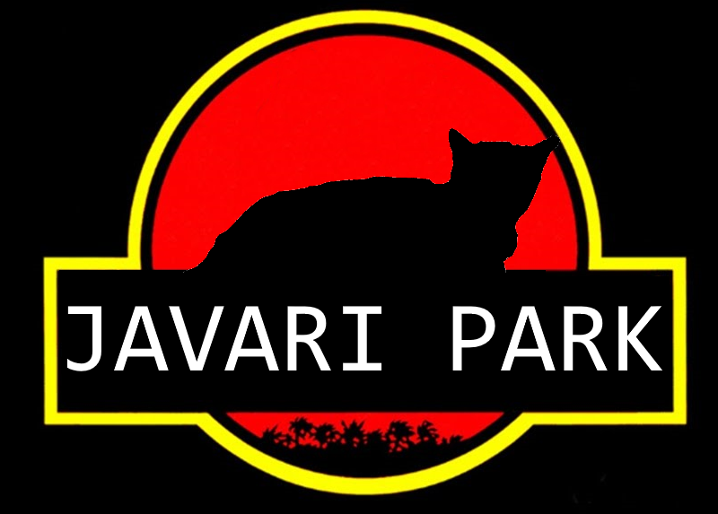

# Assignment 3: Javari Park Festival

CSGE601021 Programming Foundations 2 @ Faculty of Computer Science Universitas
Indonesia, Term 2 2017/2018

* * *

This document contains the description and general information required for
completing the **third assignment** of Programming Foundations 2 course. The
assignment is about creating a program for handling registration of park
visitor in Javari Park.

This assignment covers programming topics as follows:

- Code reusability
- Inheritance
- Programming by contract
- Introduction to interface

This assignment is published on **Friday, April 6 2018**. The due date for
pushing latest commit for this assignment is on **Friday, April 20 2018**.
Please refer to [Submission](#submission) section to see the actual due date
and time.

## Table of Contents

1. [Description](#description)
2. [Preparation](#preparation)
3. [Input/Output Examples](#inputoutput-examples)
4. [Checking](#checking)
5. [Submission](#submission)
6. [Checklists](#checklists)

## Description



New animals are coming to the Javari Park! There are rare snakes from Africa
and smart whales from Kiluan. The Javari Park management plans to create
several distinctive sections for each type of animals as they become more
various. The sections they plan to create are **"Explore the Mammals"**,
**"World of Aves"** (birds), and **"Reptilian Kingdom"**. Because you are a
programmer that works at Javari Park, you need to update your previously built
program. Now, every animal needs to be classified into those three major
sections.

Javari Park has animal attractions every week. The following is the detail of
animal attractions:

1. **Circle of Fire**: This attraction can be done by lions, whales, or eagles
2. **Dancing Animals**: This attraction can be done by parrots, snakes, cats,
or hamsters
3. **Counting Masters**: This attraction can be done by hamsters, whales, or
parrots
4. **Passionate Coders**: This attraction can be done by hamsters, cats, or
snakes

The management wants clear information from each class of animals which is
stored in your program. You need to ensure that the name, ID (yes, their ID
are unique for each animal), body length, body weight, gender, and its type
are recorded

Only animals in certain condition are eligible to do attraction. In general,
only healthy animals can do attractions. Several other, more specific
conditions are:

- **Mammals** only can do attractions if they are not **pregnant**
- **Aves** only can do attractions if they are not **laying eggs**
- Only **male lions** can do attractions
- Only **tame reptiles** can do attractions

So, this time you are requested to build a registration program that can be
used by visitors in Javari Park. The visitors can use the program to get
information about upcoming attractions in Javari Park. The program need to
be able to read data of animals from a file and generate a list of animals in
[JSON](https://www.json.org/) format. The program must be developed by
following good object-oriented programming principles and make sure it can
help the visitors to register into Javari Park Festival!

> Suggestion: Do not jump straight into coding! Plan your classes first on
> paper and make rough sketches how your classes will interact with each
> other.

> Note: A program skeleton (starter code) will be provided at later time.
> Until then, we really recommend you to develop your own solution.

The given program skeleton contains 4 Java packages and 1 empty main program
class. Each package has their own purpose:

1. `javari.animal` package contains abstraction of animals that reside in
Javari Park
    > Note: `Condition` and `Gender` of an animal are represented using Java
    > [enumeration type][EnumType]. It is similar to Java class and interface,
    > but designed specifically for representing **constant values**
2. `javari.park` package contains interfaces that dictate how a visitor's
registration and attraction selection should be implemented in the program
3. `javari.reader` package contains an abstract class that implemented CSV
file reading where it stores **all lines from given CSV file** into instance
variable named `lines`, which is an instance of `List`.
    > Note: Still wondering why `List`, which is an interface type, can refer
    > to an (concrete) object? Recall the lecture about interface!
4. `javari.writer` package contains a class that writes visitor registration
into JSON file
    > Note: `RegistrationWriter` in `javari.writer` package uses external
    > library (i.e. not included in Java standard library) for writing
    > JSON file. Ensure your text editor/IDE can read Gradle build file
    > correctly and the library is loaded by Gradle into classpath

You are allowed to reuse the skeleton code completely or partially. If you
do reuse the skeleton code, make sure your existing solution (if any) is
integrated into the structure of skeleton code.

## Preparation

Please follow the instructions in the [root (main) README][RootReadme].
**Make sure you write all Java source code files in `src/main/java`
directory!**

## Input/Output Examples

### Input File Examples

- `animals_categories.csv`
The file contains `N` lines where `N` is the number of animal categories in
Javari Park. The entries are written in following CSV format: `type`,
`category`,`section`

File example:
```
Hamster,mammals,Explore the Mammals
Lion,mammals,Explore the Mammals
Cat,mammals,Explore the Mammals
Eagle,aves,World of Aves
Parrot,aves,World of Aves
Snake,reptiles,Reptillian Kingdom
Whale,mammals,Explore the Mammals
```
- `animals_attractions.csv`
The file contains `M` lines where `M` is the number of attractions in Javari
Park. The entries are written in following CSV format: `type`,`attractions`

File example:
```
Whale,Circles of Fires
Lion,Circles of Fires
Eagle,Circles of Fires
Cat,Dancing Animals
Snake,Dancing Animals 
Parrot,Dancing Animals
Hamster,Dancing Animals
Hamster,Counting Masters
Whale,Counting Masters
Parrot,Counting Masters
Cat,Passionate Coders
Hamster,Passionate Coders
Snake,Passionate Coders
```
- `animals_records.csv`
The file contains `O` lines where `O` is the number of animals in Javari Park.
The entries are written in following CSV format: `ID`,`animal`,`name`,`m/f`,
`bodyLengthCm`,`bodyWeightKg`,`specialStatus`,`condition`

> Attention: it is possible for a data entry to have one of its attribute(s)
> empty/blank!

File example:
```
1,Hamster,hamtaro,male,5,0.25,,healthy
2,Lion,nala,female,150,130,pregnant,healthy
3,Cat,tom,male,46,4.5,,healthy
4,Eagle,igel,male,100,9,,healthy
5,Parrot,woody,male,45,1,,healthy
6,Snake,lala,female,500,10,tame,healthy
7,Whale,lulu,female,230,120,,healthy
8,Whale,baba,male,260,100,,healthy
9,Whale,mumu,male,250,90,,healthy
10,Snake,uul,male,570,12,wild,healthy
11,Eagle,el,male,98,7,,not healthy
12,Cat,meong,male,50,4,,healthy
13,Cat,mew,female,40,3.6,,not healthy
14,Hamster,ribbon,female,13,0.45,,healthy
15,Hamster,panda,male,3,0.2,,healthy
16,Lion,simba,male,250,190,,healthy
```

### Scenario Simulation

> Note: text enclosed with single asterisks (`*``*`) indicates user input
> whereas text enclosed with single underscores (`_``_`) indicates output
> according to the given data, i.e. entries from data file

```
Welcome to Javari Park Festival - Registration Service!

... Opening default section database from data. ... File not found or incorrect file!

Please provide the source data path: *D:\Data*

... Loading... Success... System is populating data...

Found _3_ valid sections and _0_ invalid sections
Found _4_ valid attractions and _0_ invalid attractions
Found _3_ valid animal categories and _0_ invalid animal categories
Found _16_ valid animal records and _0_ invalid animal records

Welcome to Javari Park Festival - Registration Service!

Please answer the questions by typing the number. Type # if you want to return to the previous menu

Javari Park has 3 sections:
1. Explore the Mammals
2. World of Aves
3. Reptilian Kingdom
Please choose your preferred section (type the number): *2*

--World of Aves--
1. Eagle
2. Parrot
Please choose your preferred animals (type the number): *2*

Unfortunately, no parrot can perform any attraction, please choose other animals

--World of Aves--
1. Eagle
2. Parrot
Please choose your preferred animals (type the number): *#*

Javari Park has 3 sections:
1. Explore the Mammals
2. World of Aves
3. Reptilian Kingdom
Please choose your preferred section (type the number): *1*

--Explore the Mammals--
1. Hamster
2. Lion
3. Cat
4. Whale
Please choose your preferred animals (type the number): *4*

---Whale---
Attractions by Whale:
1. Circles of Fire
2. Counting Masters
Please choose your preferred attractions (type the number): *2*

Wow, one more step,
please let us know your name: *Dek Depe*

Yeay, final check!
Here is your data, and the attraction you chose:
Name: Dek Depe
Attractions: Counting Masters -> Whale
With: Lulu, Baba, Mumu

Is the data correct? (Y/N): *Y*

Thank you for your interest. Would you like to register to other attractions? (Y/N): *N*

... End of program, write to registration_Dek_Depe.json ...
```

The following is content of `registration_Dek_Depe.json` file:

```
[
  {
    "Registration_ID": 1,
    "name": "Dek Depe",
    "attraction": {"name" : "Counting Master",
                   "type" : "whale", 
                   "animals" : [{"name": "Lulu"}, 
                                {"name": "Baba"}, 
                                {"name": "Mumu"}]}
  }
]
```

## Checking

You can check whether your work contain code style issues by executing the
following Gradle task:

```bash
gradle :assignment-3:checkstyleMain
```

To compile all Java source code in `src/main/java`:

```bash
gradle :assignment-3:classes
```

To run your program using Gradle in command prompt/terminal:

```bash
gradle :assignment-3:run
```

> Attention: Make sure your main program class is named `A3Festival`!

## Submission

Please save & push your latest work (commit) into your online Git
repository on GitLab **no later than 22:00 at 20/04/2018. Do not
forget to invite your TA as a Master of your GitLab project. The
teaching team will only grade your work based on the latest commit
that has been pushed no later than the specified date & time.**

## Checklists

### Mandatory Tasks Checklist

- [ ] Make at least 1 commit that contains your progress in completing
assignment 3
- [ ] Push your commits to online Git repository at your GitLab project
- [ ] Implement appropriate class(es) to the given case
- [ ] Apply inheritance and interface
- [ ] Define relationship of each classes to other classes
- [ ] Apply encapsulation
- [ ] Define instance variables and methods of each classes
- [ ] Create a feature to read .CSV data input file
- [ ] Create a feature to classify every animal to appropriate sections
- [ ] Create a feature to give information about which attractions can be
done by each type of animal
- [ ] Create a feature to identify attractions which can be done by each
animal according to their conditions
- [ ] Create a feature to record visitor registration to the chosen attractions
- [ ] Create a feature to generate .JSON output file
- [ ] Create a clear and understandable program documentation

### Additional Tasks Checklist

- [ ] Make sure there are no code style issues in your source code
- [ ] Create a scheduling mechanism for each attraction
    - Each animal attraction needs 1 hour (60 minutes)
    - Your task is to put attractions which are in the same type into different
    session schedules
    - Note that one visitor cannot come to more than one different attractions
    in the same time
- [ ] Create registration system for multiple visitors
    - The system can handle more than one visitors in one time input
    - Registration done through a .CSV file with format:
    `visitor`,`animal`,`attraction`

### Assignment Grading Scheme

- **20%** proper use of inheritance in the code
- **20%** proper use of interface in the code
- **30%** complete & correct implementation of all program features
- **20%** degree of reusability and flexibility expressed in program design
- **10%** quality of documentations (`javadoc` format and comments in the code)

[RootReadme]: ../README.md#initial-setup
[EnumType]: https://docs.oracle.com/javase/tutorial/java/javaOO/enum.html
