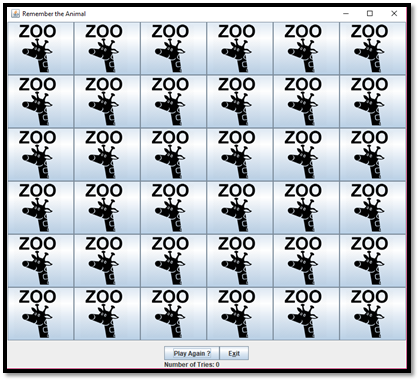
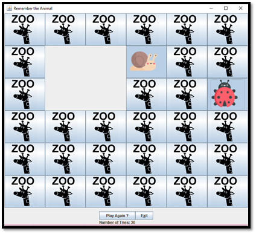

# Assignment 4: Match-Pair Memory Game

CSGE601021 Programming Foundations 2 @ Faculty of Computer Science Universitas
Indonesia, Term 2 2017/2018

* * *

This document contains the description and general information required for
completing the **fourth assignment** of Programming Foundations 2 course. The
assignment is about creating a match-pair memory game.

This assignment covers programming topics as follows:

- OO concepts
- Package & Java API
- Exception handling
- Graphical User Interface (GUI)

This assignment is published on **Thursday, May 10 2018**. The due date for
pushing latest commit for this assignment is on **Friday, May 18 2018**.
Please refer to [Submission](#submission) section to see the actual due date
and time.

## Table of Contents

1. [Description](#description)
2. [Preparation](#preparation)
3. [Example](#inputoutput-examples)
4. [Checking](#checking)
5. [Submission](#submission)
6. [Checklists](#checklists)

## Description

Javari Park wants to develop a game to be played at their zoo. The game
is a match-pair memory game where the player will have to match animal
characters that are hidden behind 6x6 grid tiles. There are 18 animal
characters hidden in the game and player must find matching characters by
checking the tiles. When player found matching pair of characters, then
the tiles that hid the characters will disappear/gone invisible.

Player can only open at most 2 tiles. If there are 2 open tiles and the
player wanted to open another tile, then previous 2 open tiles will be
closed. This game also tracks the number of attempts done by player to
match hidden character behind the tiles. Furthermore, this game also
lets player to restart the game from the beginning.

You are free to design and implement the view and layout of the game.
The images in [Example](#example) section only show possible examples of
the game's interface. Use your creativity to develop the game. You may add
additional features into the game.

## Example

The following image depicts an example of initial condition of the game.



The following image depicts the view of the game after player matched 2
hidden animal characters. The tiles disappear once the player matched 2
animal characters.



## Checking

You can check whether your work contain code style issues by executing the
following Gradle task:

```bash
gradle :assignment-4:checkstyleMain
```

To compile all Java source code in `src/main/java`:

```bash
gradle :assignment-4:classes
```

## Submission

Please save & push your latest work (commit) into your online Git
repository on GitLab **no later than 23:55 at 18/05/2018. Do not
forget to invite your TA as a Master of your GitLab project. The
teaching team will only grade your work based on the latest commit
that has been pushed no later than the specified date & time.**

## Checklists

### Assignment Grading Scheme

- **30%** exception and error handling
- **40%** complete implementation of all program features
- **20%** reusability, flexibility, and creativity in program design
- **10%** documentations (Javadoc and comments)

[RootReadme]: ../README.md#initial-setup
